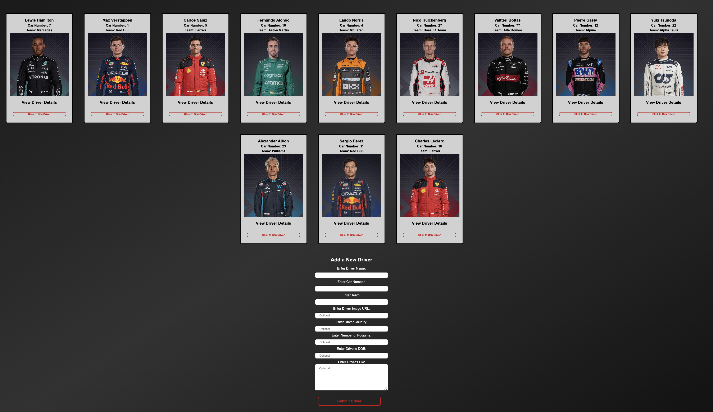
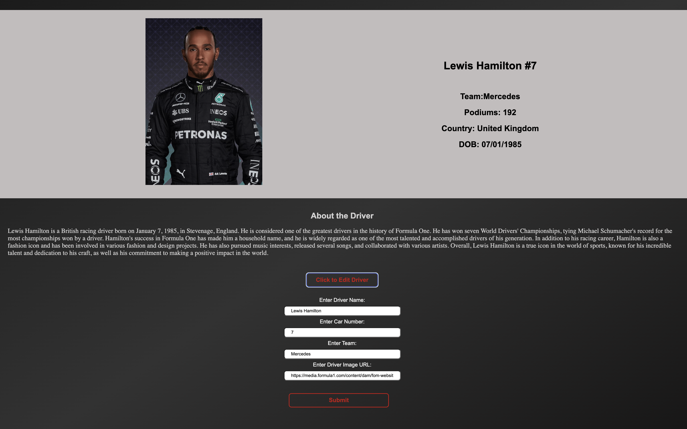
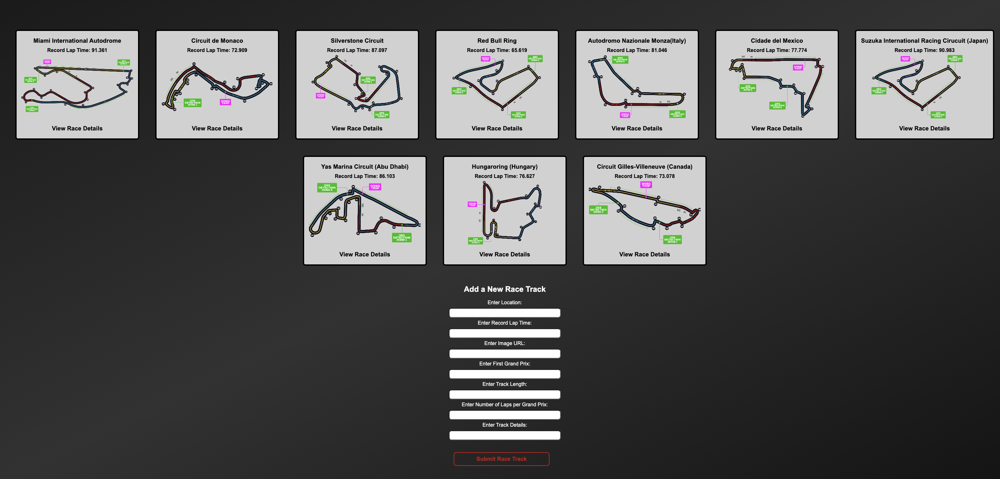

# Flask F1 Race 

## App Overview

The Flask F1-Race application is a full stack web application built using Flask, SQLAlchemy ORM, and React. It enables users to view and edit F1 race-related data, including drivers, races, and driver-race statistics.

***

## Tech Stack
Python (3.8) Flask (Backend) SQLAlchemy (Database ORM) React (Frontend) Stripe API (Secure payment processing)

### Setup & Configuration
Backend Prerequisites: 

1.Python 3.8 
2.Pip

You can install the required libraries by running the following command in your terminal:

```$ pipenv install```

run the application: ```python app.py```

### Frontend
Prerequisites:

1.npm or yarn

### Steps
Open another terminal

1.cd client 
2.npm install (yarn install) 3.npm start

The application should now be running on ```localhost:3000```


## App Screenshots


### Homepage


### Drivers Page





### Drivers Details + Form





### Races Page





### Race Stats


